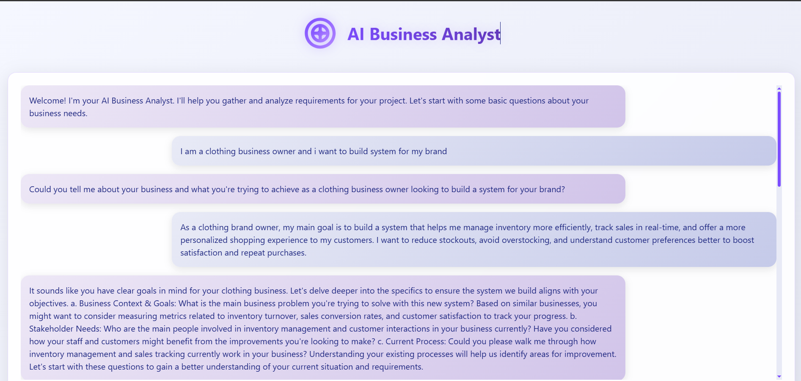
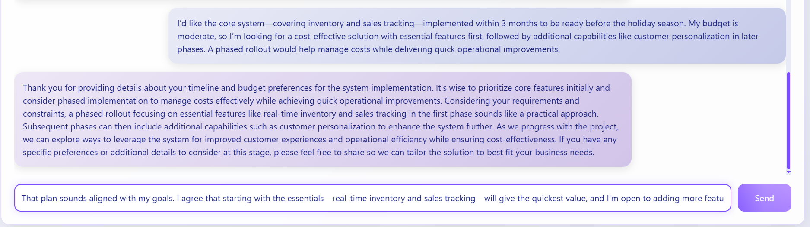

# AI Business Analyst Chat Interface

A modern, interactive web interface for the AI Business Analyst that helps gather and analyze business requirements through natural conversation.





## Features

- 🎨 Modern, clean light-mode interface
- 💬 Real-time chat interaction
- 🤖 AI-powered business analysis
- 📱 Responsive design
- ✨ Smooth animations and transitions
- 🎯 Requirement tracking and analysis

## Getting Started

### Prerequisites

- Python 3.8 or higher
- Flask
- OpenAI API key

### Installation

1. Clone the repository:
```bash
git clone https://github.com/somaiaahmed/AURA
cd AURA
```

2. Install dependencies:
```bash
pip install -r requirements.txt
```

3. Create a `.env` file in the root directory and add your OpenAI API key:
```
OPENAI_API_KEY=your_api_key_here
```

4. Run the application:
```bash
python app.py
```

5. Open your browser and navigate to:
```
http://localhost:5000
```

## Usage

1. The chat interface will open with a welcome message
2. Type your business requirements or questions in the input field
3. The AI Business Analyst will respond and help gather requirements
4. The conversation will be automatically saved in the `conversation_logs` directory

## Technologies Used

- Flask (Backend)
- HTML/CSS/JavaScript (Frontend)
- OpenAI GPT (AI Processing)
- Tailwind CSS (Styling)

## Project Structure

```
.
├── app.py                 # Flask application
├── business_analyst_agent.py  # AI Business Analyst logic
├── requirements.txt       # Python dependencies
├── templates/            # HTML templates
│   └── index.html       # Chat interface
└── conversation_logs/    # Saved conversations
```

## Contributing

Feel free to submit issues and enhancement requests!

## License

This project is licensed under the MIT License - see the LICENSE file for details. 